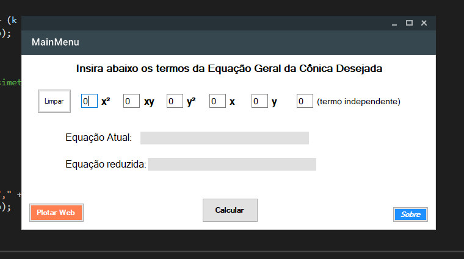
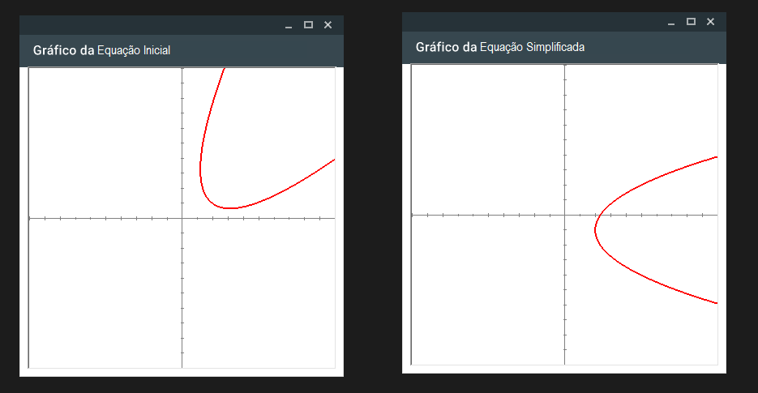

# SMA0300 - Conic Section Rotation and Translation Algorithm in C# Winforms

This project is part of SMA0300 Analytical Geometry course in USP Sao Carlos. Given a general conic section equation, this software can process it by applying rotation and translation techniques (as presented by Prof Farid's class notes) and, thus, returning a simplified equation. 

In order to execute Linear algebra operations involving matrices, we used MathNet.Numerics.LinearAlgebra library in a Visual Studio application. 

## Running the Application

Due to the fact that this application is based on Winforms C#, it can only run in a Windows-based environment. If on windows, just clone this repository and run the project on Visual Studio 2019 (preferably). If you just want to see the software running, search for its .exe file at SMA0300_Conicas\Conicas\bin\Debug\Conicas.exe

## Most important pieces of code
PS: all code comments in this project are probably written in Brazilian Portuguese. For any questions regarding the software, don't hesitate to contact me or [giovanni-shibaki](https://github.com/giovanni-shibaki)

### FuncMatematicas.cs

* **Relative Path**: SMA0300_Conicas\Conicas\FuncMatematicas.cs
* **Funcionality**: Handles all rotation and translation procedures given the coeficients of the conic section equation
* **Sample**: The function below finds the center of a conic section for translation purposes
```c#
        public void calculaH_K(double[] coeficientes)
        {
            double a = coeficientes[0];
            double b = coeficientes[1];
            double c = coeficientes[2];
            double d = coeficientes[3];
            double e = coeficientes[4];
            double f = coeficientes[5];

            var A = Matrix<double>.Build.DenseOfArray(new double[,]
            {
                { Convert.ToInt32(a), Convert.ToInt32(b/2) },
                { Convert.ToInt32(b/2), Convert.ToInt32(c) },
            });
            MessageBox.Show("Matriz para calcular H e K: "+A.ToString());
            var B = Vector<double>.Build.Dense(new double[] { -(d/2), -(e/2) });
            var x = A.Solve(B);
            MessageBox.Show("H e K: "+x.ToString());
            h = x[0];
            k = x[1];

            if(!Double.IsInfinity(getH())) // Se o determinante deu diferente de zero foi possível realizar a translação
            {
                // Achar o novo termo independente da equação: (p.96)
                setF((getD() / 2) * getH() + (getE() / 2) * getK() + getF());

                var eq = Infix.ParseOrThrow(getA().ToString() + "*u*u+" + getB().ToString() + "*u*v+" + getC().ToString() + "*v*v+"+ getF().ToString());
                var expanded = Algebraic.Expand(eq);
                MessageBox.Show("Translação realizada!\nNova equação da cônica:\n"+Infix.FormatStrict(expanded)+" ","Translação Concluida",MessageBoxButtons.OK, MessageBoxIcon.Exclamation);
                MessageBox.Show("Iniciando Rotação para elimianar o termo quadrático misto", "Iniciando Rotação", MessageBoxButtons.OK,MessageBoxIcon.Exclamation);
            }
        }
```
### ElementosGeometricos.cs

* **Relative Path**: SMA0300_Conicas\Conicas\ElementosGeometricos.cs
* **Funcionality**: This class takes care of all conic section classification and extra information procedures
* **Sample**: Down below you can check the function that receives the coeficients of a general conic section equation end tells you what conic it is. PS: The logic behind this classification function can be found at the book "Gometria Analitica - um tratamento Vetorial" by Paulo Boulos on page 458.
```c#
 public int whatConica(double[] coeficientes)
        {
            // determinante da matrix de coeficientes 3x3
            double big_det = funcMat.whole_matrix_determinant(coeficientes);
            // determinante da matriz "minor" 2x2 formada por a,b,c
            double det = funcMat.acharSolucoesSistema(coeficientes[0], coeficientes[1], coeficientes[2]);
            
            //  Conica nao degenerada: tem conicas com centro unico
            if (big_det != 0)
            {
                // conjunto vazio nos Reais   --> (A+C)*big_det > 0            
                if ((coeficientes[0] + coeficientes[2]) * big_det > 0) { return 0; }
                // circ
                else if (coeficientes[0] == coeficientes[2] && coeficientes[1] == 0) { return 5; }
                // elipse
                else if (det > 0) { return 6; }
                //Hiperbole
                else if (det < 0) { return 7; }
                // parabola
                else if (det == 0) { return 8; }
            }
            //  Conicas Degeneradas
            else if (big_det == 0)
            {
                // ponto 
                if (det > 0) { return 1; }
                // retas concorrentes
                else if (det < 0) { return 4; }
                // retas paralelas
                else if (det == 0)
                {
                    // D^2 + E^2 > 4(A+C)F
                    // distintas se
                    if ((Math.Pow(coeficientes[3], 2) + Math.Pow(coeficientes[3], 2)) > 4 * (coeficientes[0] + coeficientes[2]) * coeficientes[5])
                    {
                        return 3;
                    }
                    // coincidentes se
                    else if ((Math.Pow(coeficientes[3], 2) + Math.Pow(coeficientes[3], 2)) == 4 * (coeficientes[0] + coeficientes[2]) * coeficientes[5])
                    {
                        return 2;
                    }
                }
            }
            return -1;// ERRO
        }
```
### ConicaGraph.cs
* **Relative Path**: SMA0300_Conicas\Conicas\ConicaGraph.cs
* **Funcionality**: Draws a conic section from its polynomial equation
* **Sample**: [This is an adaptation of a polynomial equation drawing software by Rod Stephens](http://csharphelper.com/blog/2014/11/draw-a-conic-section-from-its-polynomial-equation-in-c/)

## User Interface Images

### Main Menu

 In this window the user can enter all the coeficients of a given general conic section equation. By clicking the "Calcular" button, the mathematical algorithm will initiate.
 


### Additional Information about the conic section

This interface offers additional information about the conic section expressed in the given equation. For every type of conic section, a certain set of details will be displayed on the screen.


### Function Graphing
By using the collection of functions implemented by [Rod Stephens](http://csharphelper.com/blog/author/rod-stephens/) , this interface displays the conic section given the coeficients of its general equation




## The Team

This project was developed by students of the first semester of the Computer Science course at USP Brazil.

* **Giovanni Shibaki Camargo** - [giovanni-shibaki](https://github.com/giovanni-shibaki)

* **Pedro Kenzo Muramatsu Carmo** - [Muramatsu2602](https://github.com/Muramatsu2602)
